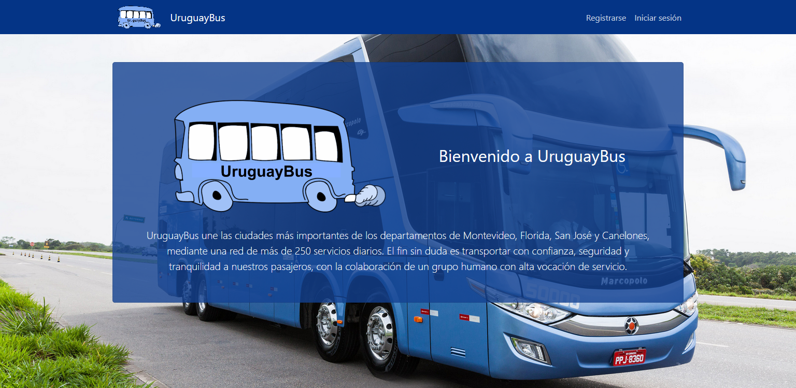
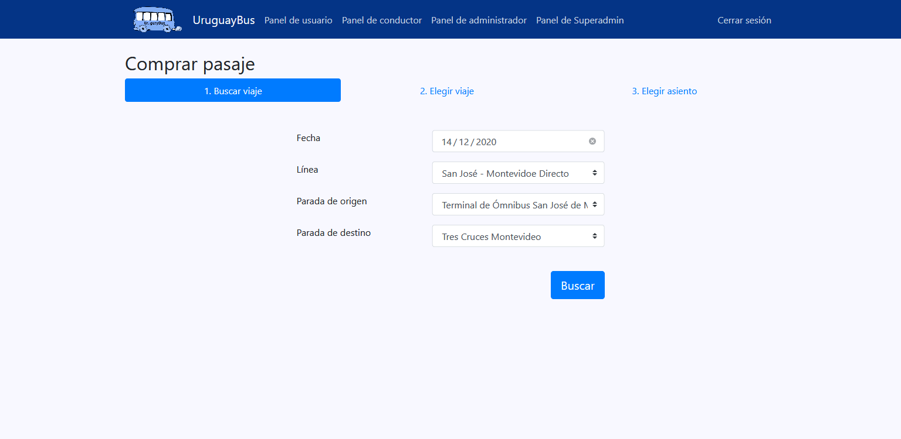
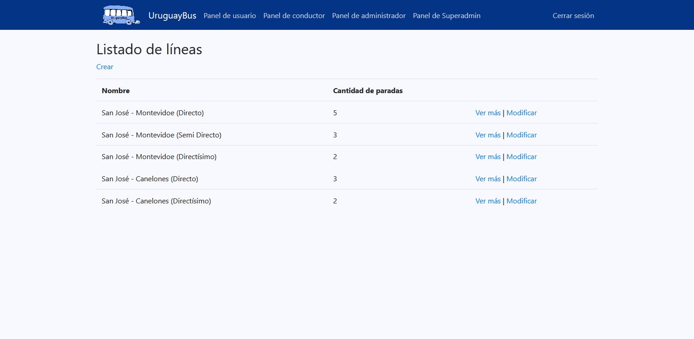
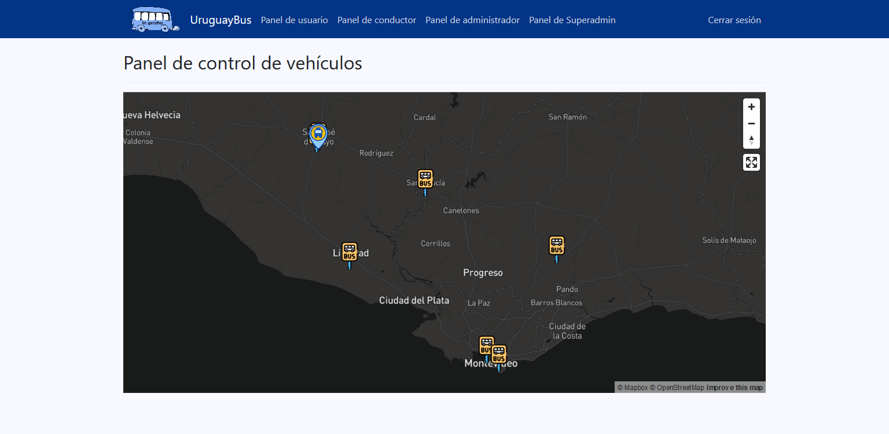
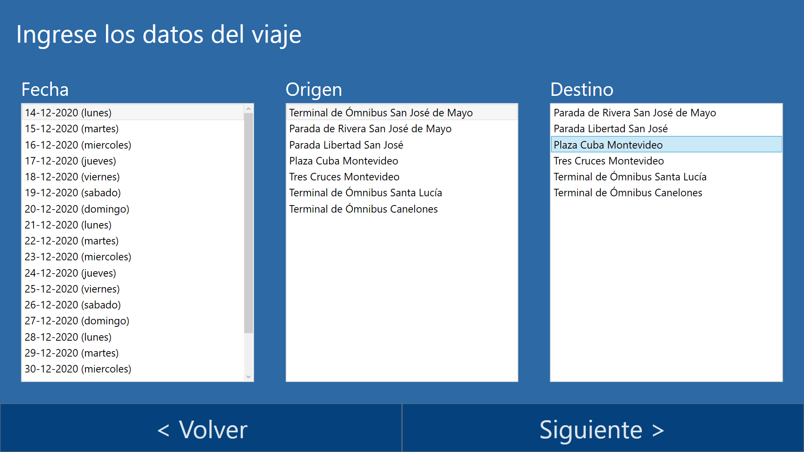
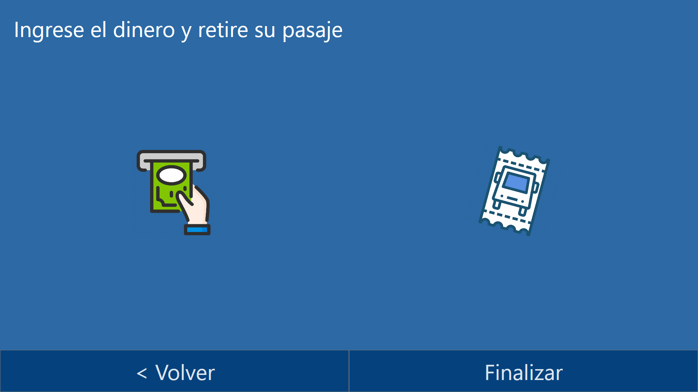

# Uruguay Bus

Taller de Sistemas de la Información .NET

**Integrantes:**
- Juan Álvarez
- Lucas Garrido
- Sebastián Morales

## Descripción general del proyecto

Una nueva empresa de transporte público interdepartamental ha surgido en Uruguay, su nombre es “Uruguay Bus”, esta empresa quiere tener una fuerte base tecnológica que le permita distinguirse del resto. Alguna de las características que considera fundamental para su puesta en marcha son:

- Brindar una forma ágil de compra de pasajes online.
- Brindar un sistema de visualización online de los vehículos que permita saber a los clientes cuánto tiempo falta para el próximo transporte pase por su parada actual.
- Un fácil control por parte del conductor de los pasajeros que suben, mediante la validación de los pasajes por lectura de código QR.

El sistema requerido estará compuesto por varias componentes de software que serán detalladas a continuación. En el caso de las componentes que tienen una interfaz de usuario se especificarán los casos de uso.

Para más información consultar  la 
<a href="./documentacion/Letra.pdf">letra del Laboratorio</a>

## Capturas de pantalla

### Sitio web
#### Inicio

---

#### Comprar pasaje

---

#### Listado de Líneas de transporte

---

#### Panel de control de vehículos

---

## Terminal de autogestión

---

